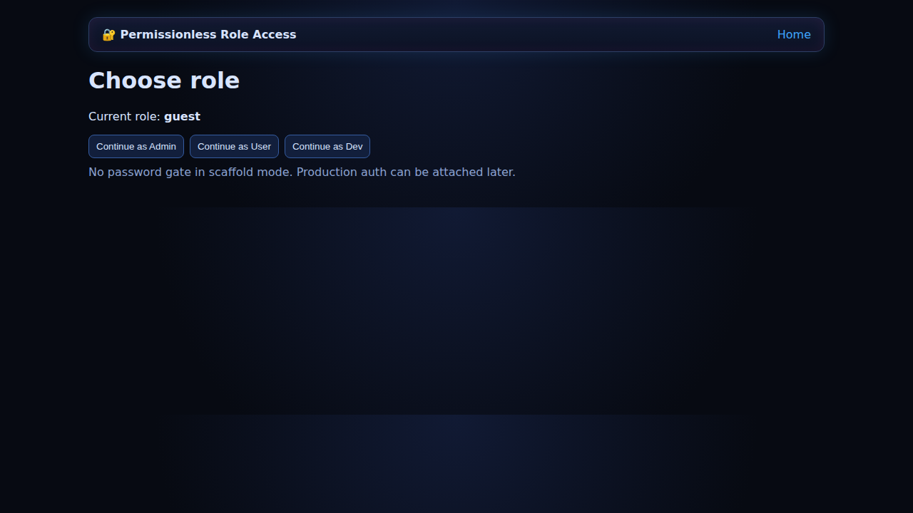
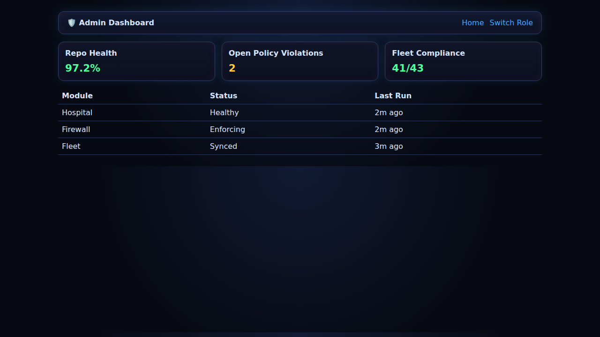

# Repo-Stabilization

Deterministic, drift-free **Repo Brain** scaffold for permissionless repository repair, verification, and governance.

## What is included

- Deterministic scaffold contract (`docs/scaffold-contract.md`)
- Repo-Brain module map covering Hospital → Fleet flow
- Static neon-glow operator UI with:
  - Landing page
  - Admin dashboard
  - User dashboard
  - Dev dashboard
  - Permissionless role login switcher
- Vercel one-shot static deployment config (`vercel.json`)
- Runnable backend API for all Repo-Brain modules (`backend/server.js`)
- Operator/developer/user/admin documentation in `docs/`

## Quick start (local)

```bash
npm start
# open http://localhost:4173
```

## Runnable Repo-Brain services

The full app now runs deterministic, auditable services for all modules:

- Hospital
- Detect
- Scan-Actions
- Normalize
- Doctor
- Surgeon
- Verify
- AI-Guard
- Firewall
- Vitals
- Fleet
- Autopsy
- Genome
- Immunizer
- Blackbox
- Fix.Safe

API endpoints:

- `GET /healthz`
- `GET /api/modules`
- `POST /api/pipeline/run`

## Deploy (Vercel)

This repository is static and ready for one-shot deploy:

1. Import the repo in Vercel
2. Keep defaults (no build command required)
3. Deploy

## Primary docs

- `docs/scaffold-contract.md`
- `docs/operator-guide.md`
- `docs/roles-and-permissions.md`
- `docs/deployment-vercel.md`
- `docs/ui-screenshots.md`

## UI screenshots

### Landing dashboard



### Login role switcher


### Login storage hardening validation


### Admin dashboard (updated)



### Admin dashboard (runnable services)

https://github.com/user-attachments/assets/b307cd76-193c-449a-b55e-6e18fd54d607
